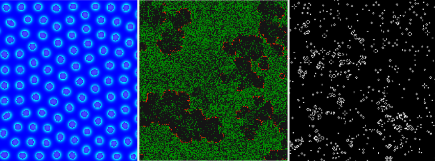

# Hayyoth Lab

> We stole Zeus's lightning, trapped it in stone, and taught it to think.



Hayyoth Lab is a small and fast C framework for building, running, and observing computational worlds.

The idea is simple:

```text
simple state
     +
simple rules
     ↓
  emergence
```

You define a state and the rules that transform it. Hayyoth provides a small amount of machinery to run those rules and observe what happens.

It does not try to define what a computational world should be.

You build the machine, run it, and see what emerges.

Inspired by the philosophy of [hayyoth.org](https://hayyoth.org).

---

## A World in a Few Lines

Here is a complete Conway's Game of Life experiment:

```c
#include "hayyoth.h"

typedef unsigned char Cell;

void init(void *state, size_t height, size_t width) {
  Cell *cells = state;

  for (size_t y = 0; y < height; y++)
    for (size_t x = 0; x < width; x++)
      cells[y * width + x] = hRand(0, 9) == 0;
}

void rule(void *c[9], void *n[9]) {
  int alive = 0;
  for (int i = 1; i < 9; i++)
    if (c[i])
      alive += *(Cell *)c[i];

  *(Cell *)n[0] = alive == 3 || (alive == 2 && *(Cell *)c[0]);
}

HrdView view(const void *cell) {
  const Cell *c = cell;
  if (*c)
    return (HrdView){.r = 255, .g = 255, .b = 255, .a = 255, .s = "x"};

  return (HrdView){.r = 0, .g = 0, .b = 0, .a = 255, .s = "  "};
}

int main(void) {
  HcellConf cellConf = {.width = 300, .height = 300, .cellSize = sizeof(Cell)};
  HrdConf rdConf = {.fps = 15, .scale = 2};
  if (!hSetup(cellConf, rdConf))
    return 1;

  hDataInit(init);
  while (hRun()) {
    hCell(rule);
    hRender(view);
  }
  return 0;
}
```

Simple Ants move random and eat food:

```c
#include "hayyoth.h"

#define ANTS 40
#define FOODS 40

typedef struct {
  unsigned char ant;
  unsigned char food;
} Cell;

static void init(void *raw, size_t h, size_t w) {
  Cell *s = raw;

  for (int i = 0; i < ANTS; i++) {
    int x = hRand(0, w - 1);
    int y = hRand(0, h - 1);
    s[y * w + x].ant = 1;
  }

  for (int i = 0; i < FOODS; i++) {
    int x = hRand(0, w - 1);
    int y = hRand(0, h - 1);
    s[y * w + x].food = 1;
  }
}

static void rule(void *c[9], void *n[9]) {
  Cell *self = c[0];

  if (!self || !self->ant)
    return;

  Cell *current = n[0];
  Cell *next = n[hRand(1, 8)];

  if (!next || next->ant)
    return;

  *current = (Cell){0};
  *next = *self;
  next->food = 0;
}

static HrdView view(const void *raw) {
  const Cell *c = raw;

  if (c->ant)
    return (HrdView){255, 80, 80, 255, NULL};
  if (c->food)
    return (HrdView){255, 180, 0, 255, NULL};
  return (HrdView){0, 0, 0, 255, NULL};
}

int main(void) {
  HcellConf cellConf = {.width = 80, .height = 80, .cellSize = sizeof(Cell)};
  HrdConf rdConf = {.fps = 15, .scale = 7};
  if (!hSetup(cellConf, rdConf))
    return 1;

  hDataInit(init);

  while (hRun()) {
    hCell(rule);
    hRender(view);
  }
}
```

There is no world class, object hierarchy, scene graph, entity system, or predefined simulation model here.

You define the cell.

You define the initial state.

You define the rule.

You define how a cell looks.

Hayyoth provides the machinery connecting them.

That is the whole idea.

---

## Philosophy

Every complex system starts from something simpler.

Hayyoth Lab is built around the idea that a computational world does not need to be described as a finished system.

Start with:

```text
state
  +
rules
  ↓
process
  ↓
patterns
  ↓
emergence
```

The interesting part is what happens between the rules and the result.

You may begin with a handful of simple interactions and discover structures that were never explicitly programmed.

Hayyoth is therefore intended as a laboratory rather than a conventional application framework.

Build something small.

Run it.

Observe it.

Change the rules.

Run it again.

---

## Installation

Hayyoth uses a small Makefile-based build system.

### Dependencies

You need:

* a C compiler (`cc`, `clang`, or `gcc`)
* `make`
* `pkg-config`
* [raylib](https://www.raylib.com/)

The Makefile uses `pkg-config` to locate raylib.

### Build

From the project directory:

```sh
make
```

It then builds the Hayyoth libraries and every experiment in `lab/`.

The generated files are placed under:

```text
build/
├── src/
│   ├── libhcell.*
│   ├── libhrender.*
│   └── libhayyoth.*
└── lab/
    ├── ants.out
    └── conway.out
```

### Run a Lab

The experiments live in `lab/`.

For example:

```sh
make run-conway
```

or:

```sh
make run-ants
```

The general form is:

```sh
make run-<name>
```

for an experiment named:

```text
lab/<name>.c
```

---

## Project Structure

The repository is intentionally small:

```text
hayyoth-lab/
├── src/
│   ├── hayyoth.c
│   ├── hayyoth.h
│   ├── hcell.c
│   ├── hcell.h
│   ├── hrender.c
│   └── hrender.h
└── lab/
    ├── ants.c
    ├── conway.c
    └── ...
```

### `src/`

This is the framework itself.

* **`hayyoth.c / hayyoth.h`** — the simple unified API.
* **`hcell.c / hcell.h`** — state storage, double buffering, and neighborhood rules.
* **`hrender.c / hrender.h`** — terminal and graphical rendering.

### `lab/`

This is where the framework is used to build computational worlds.

The labs are deliberately ordinary C programs.

Read them.

Change them.

Break them.

Build your own.

If you want to understand how Hayyoth is actually used, `lab/conway.c` is a good place to start.

If you want to see a less traditional world, look at `lab/ants.c`.

---

# How Hayyoth Works

The framework can be understood as three small pieces:

```text
             your program
                  │
       ┌──────────┼──────────┐
       ↓          ↓          ↓
     State       Rule      Render
       │          │          │
       └──────────┼──────────┘
                  ↓
             Hayyoth
```

The framework does not own the meaning of your state.

It only knows:

* how large the world is,
* how large one cell is,
* where the current state lives,
* where the next state lives,
* how to visit each cell,
* and how to pass a cell to your rule or renderer.

Everything else is yours.

---

## 1. State

When you configure:

```c
HcellConf cellConf = {
  .width = 200,
  .height = 200,
  .cellSize = sizeof(Cell)
};
```

Hayyoth allocates two buffers:

```text
current state                 next state

┌───────────────┐             ┌───────────────┐
│               │             │               │
│   WORLD NOW   │             │ WORLD TO COME │
│               │             │               │
└───────────────┘             └───────────────┘
```

The framework does not require a particular `Cell` type.

It can be:

```c
typedef char Cell;
```

or:

```c
typedef struct {
  float food;
  float energy;
  int ant;
} Cell;
```

or anything else that can be represented as a block of memory.

Hayyoth only needs:

```text
cellSize
```

to know how far apart cells are in memory.

---

## 2. Double Buffering

A simulation step reads from the current state and writes to the next state.

```text
current                     next

   │                          │
   │                          │
   └─────── rule ─────────────┘
              │
              ↓
        new world state
```

The rule never needs to modify the current world.

It calculates what the world should become and writes that result into `next`.

After every cell has been processed:

```text
current ← next
```

This prevents one cell from seeing a mixture of old and already-updated neighbors.

---

## 3. Neighborhoods

`hcellRun()` visits every cell and constructs a 3×3 neighborhood:

```text
c[5]  c[1]  c[6]

c[4]  c[0]  c[2]

c[8]  c[3]  c[7]
```

The center is always:

```text
c[0]
```

The other eight positions are its neighbors.

For every position, Hayyoth provides two pointers:

```c
c[9]
n[9]
```

`c` points into the current state.

`n` points into the next state.

At the edge of the world, positions outside the grid are represented by `NULL`.

This means boundary behavior is not hidden behind another abstraction. Your rule can decide what to do when a neighbor does not exist.

---

## 4. Rules

A rule is simply:

```c
typedef void (*hcellRule)(void *c[9], void *n[9]);
```

For example:

```c
void rule(void *c[9], void *n[9]) {
  Cell *self = c[0];
  Cell *next = n[0];

  /* decide what this cell becomes */
}
```

Hayyoth does not know what your rule means.

It could represent:

* Conway's Game of Life
* ants
* particles
* cellular automata
* diffusion
* growth
* ecological interactions
* artificial organisms
* or something completely different.

The framework only provides the local computational structure.

---

## 5. Rendering

Rendering is independent from simulation.

The renderer visits each cell and calls:

```c
typedef HrdView (*hrdView)(const void *cell);
```

Your function receives one cell.

It does not receive `x`, `y`, the whole state, or the renderer.

It simply decides how that cell should be represented.

For a graphical renderer:

```c
HrdView view(const void *raw) {
  const Cell *cell = raw;

  if (*cell)
    return (HrdView){255, 255, 255, 255};

  return (HrdView){0, 0, 0, 255};
}
```

For the terminal:

```c
HrdView view(const void *raw) {
  const Cell *cell = raw;

  if (*cell)
    return (HrdView){.s = "x"};

  return (HrdView){.s = "  "};
}
```

The same simulation can therefore be observed through different renderers without changing its rules.

---

# Main API Reference

The easiest way to use Hayyoth is:

```c
#include "hayyoth.h"
```

`hayyoth.h` combines the lower-level modules into a small interface.

A typical program looks like:

```text
hSetup()
    ↓
hDataInit()
    ↓
┌─────────────────┐
│     hRun()      │
│       ↓         │
│     hCell()     │
│       ↓         │
│    hRender()    │
└─────────────────┘
```

Each function has one simple responsibility.

---

## `hSetup()`

```c
int hSetup(HcellConf cellConf, HrdConf rdConf);
```

Initializes the cell system and renderer.

Example:

```c
HcellConf cellConf = {
  .width = 200,
  .height = 200,
  .cellSize = sizeof(Cell)
};

HrdConf rdConf = {
  .fps = 15,
  .scale = 2
};

if (!hSetup(cellConf, rdConf))
  return 1;
```

`hSetup()` also initializes the random generator used by `hRand()`.

---

## `hDataInit()`

```c
typedef void (*hInit)(void *state, size_t height, size_t width);

void hDataInit(hInit init);
```

Passes the initial state to your initializer.

Example:

```c
void init(void *state, size_t height, size_t width) {
  Cell *cells = state;

  for (size_t y = 0; y < height; y++)
    for (size_t x = 0; x < width; x++)
      cells[y * width + x] = 0;
}
```

Then:

```c
hDataInit(init);
```

After initialization, Hayyoth copies the initial state into the second buffer so both buffers start from the same world.

---

## `hRun()`

```c
int hRun(void);
```

Used as the simulation loop condition:

```c
while (hRun()) {
    ...
}
```

For the graphical renderer, it checks whether the window should close.

When the loop ends, it releases the framework resources.

---

## `hCell()`

```c
void hCell(hcellRule rule);
```

Runs one complete simulation step.

```c
while (hRun()) {
  hCell(rule);
  hRender(view);
}
```

Internally, it visits every cell, constructs its neighborhood, calls your rule, and commits the resulting next state.

---

## `hRender()`

```c
void hRender(hrdView view);
```

Renders the current state.

```c
hRender(view);
```

Your `view()` receives one cell at a time and returns an `HrdView`.

For GUI rendering:

```c
HrdView view(const void *cell) {
  return (HrdView){255, 255, 255, 255};
}
```

For terminal rendering:

```c
HrdView view(const void *cell) {
  return (HrdView){.s = "x"};
}
```

The renderer handles the traversal, timing, texture update, and display.

---

## `hRand()`

```c
int hRand(int min, int max);
```

Returns an integer in the inclusive range:

```c
hRand(0, 9);
```

can return any value from `0` through `9`.

The random generator is initialized by `hSetup()`.

---

# Using the Lower-Level Modules

`hayyoth.h` is only the easiest interface.

It is not the whole framework.

The lower-level modules can be used independently.

---

## `hcell.h`

Use `hcell.h` when you want Hayyoth to manage the computational state and neighborhood rules, but you want to control everything else.

```c
#include "hcell.h"
```

Initialize it:

```c
HcellConf cellConf = {
  .width = 200,
  .height = 200,
  .cellSize = sizeof(Cell)
};

hcellSetup(cellConf);
```

Access the buffers:

```c
void *state = hcellState();
void *next = hcellNext();
```

Run the rule engine:

```c
while (running) {
  hcellRun(rule);

  /* your renderer */
  /* your timing */
  /* your input */
  /* your networking */
}
```

When finished:

```c
hcellFree();
```

You can therefore use Hayyoth's cell engine without using its renderer or its main loop.

---

## `hrender.h`

Use `hrender.h` when you already have your own simulation.

```c
#include "hrender.h"
```

Configure the renderer:

```c
HrdConf conf = {
  .width = 200,
  .height = 200,
  .cellSize = sizeof(Cell),

  .title = "My Lab",
  .fps = 30,
  .scale = 5,
  .isTerm = 1 // Render in terminal
};

hrdSetup(conf);
```

Then give it your own state:

```c
hrdRender(state, view);
```

Your program remains responsible for:

```text
state
rules
simulation
timing
input
```

while Hayyoth handles:

```text
cell traversal
terminal output
graphical output
```

When finished:

```c
hrdFree();
```

---

## Mix and Match

You can also combine the modules:

```c
#include "hcell.h"
#include "hrender.h"
```

and build your own loop:

```text
             Your program
                  │
        ┌─────────┴─────────┐
        ↓                   ↓
     hcell.h            hrender.h
        │                   │
   state + rules          display
        │                   │
        └─────────┬─────────┘
                  ↓
             your loop
```

Or use neither module's main loop and directly access the state:

```c
void *state = hcellState();
void *next = hcellNext();
```

and implement your own algorithm.

This is intentional.

Hayyoth is a collection of small pieces rather than a system that must own your entire program.

---

# The Thin Layer

The most important design principle of Hayyoth is that **the framework should stay small**.

It does not require a particular:

* cell type
* state model
* rule system
* renderer
* main loop
* simulation algorithm

The simplest user can write:

```c
#include "hayyoth.h"
```

and get a complete simulation loop.

A user who needs more control can instead use:

```c
#include "hcell.h"
```

and keep their own renderer.

Or:

```c
#include "hrender.h"
```

and keep their own simulation.

Or combine the two.

The layers look like this:

```text
                    Hayyoth
                       │
          ┌────────────┴────────────┐
          │                         │
       hcell.h                  hrender.h
          │                         │
   state + rules                 render
          │                         │
          └────────────┬────────────┘
                       │
                  hayyoth.h
               simple interface
```

`hayyoth.h` is therefore a convenience layer, not a mandatory architecture.

Start with the simple interface.

Drop down to `hcell.h` or `hrender.h` when you need control.

Or take only the pieces that are useful and build the rest yourself.

The framework stays small.

The world you build on top of it does not have to be.
